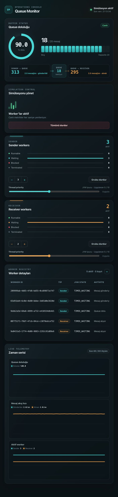
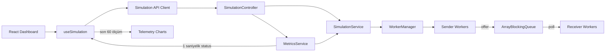

# Queue Monitor

Queue Monitor, sınırlı kapasiteli bir mesaj kuyruğunda çalışan sender ve receiver
thread'lerini gerçek zamanlı olarak yönetmek ve gözlemlemek için geliştirilmiş
full-stack bir simülasyon uygulamasıdır.

Spring Boot backend worker yaşam döngüsünü ve thread-safe queue'yu yönetir. React
dashboard ise queue doluluğunu, mesaj akış hızlarını, worker durumlarını ve thread
priority değerlerini saniyelik ölçümlerle görselleştirir.



## Özellikler

- Sender/receiver sayısı ve queue kapasitesiyle simülasyon başlatma
- Çalışan simülasyona dinamik worker ekleme veya worker azaltma
- Tüm worker'ları ya da yalnızca bir worker grubunu güvenli biçimde durdurma
- UUID üzerinden tekil worker durdurma
- Queue doluluğu ve toplam üretilen/tüketilen mesaj sayaçları
- Son 60 ölçüm için queue, mesaj hızı ve aktif worker grafikleri
- JVM thread state ve uygulama aktivite durumlarının ayrı izlenmesi
- Sender ve receiver grupları için `1–10` aralığında thread priority yönetimi
- Yeni worker'ların grubun uygulanmış priority değerini devralması
- Alan bazlı validation mesajları, işlem bildirimleri ve durdurma onayı
- Responsive dashboard ve erişilebilir form/dialog kontrolleri
- OpenAPI/Swagger dokümantasyonu ve RFC 9457 `ProblemDetail` hata cevapları

## Teknolojiler

| Katman | Teknolojiler |
| --- | --- |
| Backend | Java 21, Spring Boot 4, Spring Web MVC, Bean Validation |
| Concurrency | `ArrayBlockingQueue`, platform thread'leri, `ConcurrentHashMap` |
| API | REST, OpenAPI 3, Swagger UI, RFC 9457 Problem Details |
| Frontend | React 19, Vite 8, CSS |
| Test | JUnit 5, MockMvc, Vitest, React Testing Library, jsdom |

## Gereksinimler

- Java 21+
- Node.js 22+
- npm 10+

Maven ayrıca kurulmak zorunda değildir; backend Maven Wrapper içerir.

## Hızlı başlangıç

Önce backend'i başlatın:

```bash
cd backend
./mvnw spring-boot:run
```

Windows için:

```powershell
cd backend
mvnw.cmd spring-boot:run
```

Ardından ayrı bir terminalde frontend'i başlatın:

```bash
cd frontend
npm install
npm run dev
```

Servisler:

| Servis | Adres |
| --- | --- |
| Dashboard | http://localhost:5173 |
| REST API | http://localhost:8080/api/simulation |
| Swagger UI | http://localhost:8080/swagger-ui.html |
| OpenAPI JSON | http://localhost:8080/v3/api-docs |

Vite geliştirme sunucusu `/api` isteklerini varsayılan olarak backend'in `8080`
portuna yönlendirir.

## Mimari



Backend aynı anda tek simülasyon çalıştırır. Worker kayıtları
`ConcurrentHashMap`, mesaj paylaşımı bounded `ArrayBlockingQueue` ve çalışma
bayrakları `AtomicBoolean` ile yönetilir. Yaşam döngüsü işlemleri servis
katmanındaki `synchronized` metotlarla atomik tutulur.

Frontend `GET /status` endpoint'ini saniyede bir çağırır. En son 60 ölçüm yalnızca
tarayıcı belleğinde tutulur; sayfa yenilendiğinde grafik geçmişi yeniden başlar.

## API özeti

Temel adres: `http://localhost:8080/api/simulation`

| Metot | Endpoint | Açıklama |
| --- | --- | --- |
| `POST` | `/start` | Yeni simülasyon başlatır |
| `GET` | `/status` | Queue, mesaj ve worker metriklerini döndürür |
| `POST` | `/workers` | Çalışan simülasyona worker ekler |
| `DELETE` | `/workers?type=SENDER` | Belirtilen tipte bir worker durdurur |
| `DELETE` | `/workers/{workerId}` | UUID ile seçilen worker'ı durdurur |
| `PATCH` | `/workers/priority` | Worker grubunun priority değerini değiştirir |
| `POST` | `/stop` | `ALL`, `SENDERS` veya `RECEIVERS` kapsamını durdurur |

İstek/cevap örnekleri ve yapılandırma seçenekleri için
[backend dokümantasyonuna](backend/README.md) bakın.

## Test ve kalite kontrolleri

Backend testleri:

```bash
cd backend
./mvnw test
```

Frontend testleri:

```bash
cd frontend
npm test
```

Frontend testlerini geliştirme sırasında izleme modunda çalıştırmak için:

```bash
npm run test:watch
```

Lint ve production build:

```bash
npm run lint
npm run build
```

Frontend testleri API hata dönüşümünü, form validation akışlarını, onay
dialog'unu, priority kontrolünü, worker tablosunu ve telemetri geçmişini kapsar.

## Proje yapısı

```text
.
├── backend/              # Spring Boot REST API ve worker motoru
│   └── src/
├── frontend/             # React dashboard
│   └── src/
│       ├── api/          # HTTP istemcisi
│       ├── components/   # Dashboard bileşenleri
│       └── hooks/        # Polling ve telemetri durumu
└── docs/                 # README görselleri
```

Frontend'e özel geliştirme notları için
[frontend dokümantasyonuna](frontend/README.md) bakın.

## Thread priority hakkında

Priority değeri Java'nın `Thread.MIN_PRIORITY` ve `Thread.MAX_PRIORITY`
karşılıkları olan `1–10` aralığındadır. Dashboard'da “Uygula” seçilen tipteki
tüm aktif worker'lara değeri gönderir ve backend bu değeri grup ayarı olarak
saklar. Daha sonra eklenen worker'lar aynı değeri devralır.

Thread priority JVM ve işletim sistemi scheduler'ına verilen bir ipucudur;
deterministik çalışma sırası veya kesin throughput artışı garanti etmez. Bu
simülasyonda worker sayısı ve sabit çalışma aralığı genellikle daha belirgin etki
yaratır.

## Bilinen sınırlamalar

- Simülasyon, worker kayıtları ve sayaçlar yalnızca bellekte tutulur.
- Aynı anda tek bir simülasyon çalıştırılabilir.
- Grafik geçmişi frontend belleğindedir ve en fazla 60 ölçüm içerir.
- Canlı güncelleme polling ile yapılır; WebSocket veya SSE kullanılmaz.
- Thread priority davranışı JVM ve işletim sistemine göre farklılık gösterebilir.
- Kimlik doğrulama ve kalıcı veri saklama bulunmaz.

## Ayrıntılı dokümantasyon

- [Backend ve API](backend/README.md)
- [Frontend geliştirme ve testler](frontend/README.md)
