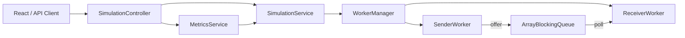

# Queue Monitor Backend

Spring Boot tabanlı bu servis, sınırlı kapasiteli bir kuyruk üzerinde çalışan dinamik
sender ve receiver worker'larını yönetir. Worker sayıları çalışma sırasında
artırılabilir veya azaltılabilir; kuyruk doluluğu ve thread durumları düzenli
olarak ölçülerek REST API üzerinden sunulur.

## Teknolojiler

- Java 21
- Spring Boot 4.1.1
- Spring Web MVC
- Jakarta Bean Validation
- springdoc-openapi 3.1.1 ve Swagger UI
- JUnit 5 ve MockMvc
- Maven Wrapper

## Gereksinimler

- Java 21 veya üzeri
- Ayrı bir Maven kurulumu gerekmez; proje Maven Wrapper içerir.

Java sürümünü kontrol etmek için:

```bash
java -version
```

## Uygulamayı çalıştırma

`backend` dizininde:

```bash
./mvnw spring-boot:run
```

Windows üzerinde:

```powershell
mvnw.cmd spring-boot:run
```

Uygulama varsayılan olarak `http://localhost:8080` adresinde çalışır. Çalışan
uygulamayı durdurmak için terminalde `Ctrl+C` kullanılabilir.

## API dokümantasyonu

Uygulama çalışırken:

- Swagger UI: http://localhost:8080/swagger-ui.html
- OpenAPI JSON: http://localhost:8080/v3/api-docs

Swagger UI içindeki **Try it out** seçeneğiyle tüm endpoint'ler tarayıcıdan
çalıştırılabilir.

## Yapılandırma

Varsayılan değerler `src/main/resources/application.properties` dosyasındadır.

| Ayar | Varsayılan | Açıklama |
| --- | ---: | --- |
| `app.cors.allowed-origins` | `http://localhost:5173` | API'ye erişmesine izin verilen frontend origin'i |
| `simulation.max-workers` | `100` | Aynı anda çalışabilecek toplam aktif worker sınırı |
| `simulation.max-queue-capacity` | `1000` | İstekle oluşturulabilecek en büyük queue kapasitesi |
| `simulation.worker-interval` | `1s` | Worker işlemleri arasındaki bekleme süresi |
| `simulation.metrics-interval` | `1s` | Metriklerin yenilenme aralığı |
| `springdoc.swagger-ui.path` | `/swagger-ui.html` | Swagger UI adresi |

Spring Boot relaxed binding sayesinde ayarlar ortam değişkenleriyle de
değiştirilebilir. Örnek:

```bash
SIMULATION_MAX_WORKERS=50 \
APP_CORS_ALLOWED_ORIGINS=http://localhost:3000 \
./mvnw spring-boot:run
```

Birden fazla CORS origin'i virgülle ayrılabilir:

```properties
app.cors.allowed-origins=http://localhost:5173,http://localhost:3000
```

## Mimari



Temel bileşenler:

- **SimulationController:** HTTP isteklerini doğrular ve servis katmanına aktarır.
- **SimulationService:** Simülasyon yaşam döngüsünü yönetir, worker ve queue
  sınırlarını uygular.
- **WorkerManager:** Worker kayıtlarını ve worker thread'lerini yönetir.
- **SenderWorker:** Mesaj üretir ve `offer` ile bounded queue'ya eklemeyi dener.
- **ReceiverWorker:** `poll` ile kuyruktan mesaj tüketir ve tüketilen mesajı loglar.
- **MetricsService:** Queue doluluğunu ve JVM thread durumlarını belirli aralıklarla
  ölçerek son sonucu bellekte tutar.
- **GlobalExceptionHandler:** Doğrulama ve çalışma zamanı hatalarını ortak
  `ProblemDetail` formatına dönüştürür.

### Eşzamanlılık yaklaşımı

- Mesaj paylaşımı thread-safe `ArrayBlockingQueue` üzerinden yapılır.
- Worker kayıtları `ConcurrentHashMap` içinde tutulur.
- Worker çalışma durumu `AtomicBoolean` ile yönetilir.
- Thread ve aktivite durumları görünürlük için `volatile` alanlarda tutulur.
- Simülasyon yaşam döngüsü işlemleri `synchronized` metotlarla atomik hale
  getirilir.
- Worker durdurulurken çalışma bayrağı kapatılır ve ilgili thread interrupt edilir.
- Uygulama kapanırken executor ve worker'lar güvenli biçimde sonlandırılır.

## API

Temel adres:

```text
http://localhost:8080/api/simulation
```

### Simülasyonu başlat

```http
POST /api/simulation/start
Content-Type: application/json
```

```json
{
  "senderCount": 2,
  "receiverCount": 1,
  "queueCapacity": 10
}
```

```bash
curl -X POST http://localhost:8080/api/simulation/start \
  -H "Content-Type: application/json" \
  -d '{"senderCount":2,"receiverCount":1,"queueCapacity":10}'
```

Başarılı cevap kodu: `201 Created`.

### Güncel durumu getir

```http
GET /api/simulation/status
```

```bash
curl http://localhost:8080/api/simulation/status
```

Örnek cevap:

```json
{
  "running": true,
  "queue": {
    "size": 3,
    "capacity": 10,
    "occupancyPercentage": 30.0
  },
  "senders": {
    "total": 2,
    "runnable": 0,
    "waiting": 2,
    "blocked": 0,
    "terminated": 0
  },
  "receivers": {
    "total": 1,
    "runnable": 0,
    "waiting": 1,
    "blocked": 0,
    "terminated": 0
  },
  "timestamp": "2026-09-08T20:00:00Z"
}
```

`total` alanı aktif ve sonlandırılmış worker kayıtlarının toplamıdır. Aktif worker
sayısı `runnable + waiting + blocked` olarak hesaplanabilir.

### Worker ekle

```http
POST /api/simulation/workers
Content-Type: application/json
```

```json
{
  "type": "RECEIVER",
  "count": 2
}
```

```bash
curl -X POST http://localhost:8080/api/simulation/workers \
  -H "Content-Type: application/json" \
  -d '{"type":"RECEIVER","count":2}'
```

`type` değeri `SENDER` veya `RECEIVER` olabilir. Başarılı cevap kodu
`201 Created` değeridir.

### Tipine göre bir worker azalt

```http
DELETE /api/simulation/workers?type=SENDER
```

```bash
curl -X DELETE \
  "http://localhost:8080/api/simulation/workers?type=SENDER"
```

Belirtilen tipteki aktif worker'lardan biri güvenli biçimde durdurulur.

### Kimliğine göre worker durdur

```http
DELETE /api/simulation/workers/{workerId}
```

```bash
curl -X DELETE \
  http://localhost:8080/api/simulation/workers/WORKER_UUID
```

### Worker grubunu durdur

```http
POST /api/simulation/stop
Content-Type: application/json
```

```json
{
  "scope": "ALL"
}
```

```bash
curl -X POST http://localhost:8080/api/simulation/stop \
  -H "Content-Type: application/json" \
  -d '{"scope":"ALL"}'
```

`scope` için geçerli değerler:

- `ALL`: Tüm worker'ları durdurur.
- `SENDERS`: Sender worker'larını durdurur.
- `RECEIVERS`: Receiver worker'larını durdurur.

## Hata cevapları

Hatalar RFC 9457 uyumlu Spring `ProblemDetail` yapısıyla döner.

| HTTP kodu | Kullanım |
| --- | --- |
| `400 Bad Request` | Geçersiz JSON, parametre, doğrulama veya sınır ihlali |
| `404 Not Found` | Worker ya da istenen tipte aktif worker bulunamadı |
| `409 Conflict` | İşlem mevcut simülasyon durumunda uygulanamaz |
| `500 Internal Server Error` | Beklenmeyen sunucu hatası |

Örnek:

```json
{
  "type": "about:blank",
  "title": "Simulation state conflict",
  "status": 409,
  "detail": "Simulation is already running",
  "instance": "/api/simulation/start",
  "timestamp": "2026-09-08T20:00:00Z"
}
```

Alan doğrulama hatalarında cevap ayrıca alan bazlı `errors` nesnesi içerir.

## Testler

Tüm testleri çalıştırmak için:

```bash
./mvnw test
```

Test paketi şunları kapsar:

- Sender ve receiver worker yaşam döngüsü
- WorkerManager işlemleri
- Simülasyon başlatma, ekleme ve durdurma akışları
- Worker ve queue sınırları
- Scheduled metrik üretimi
- Request doğrulama ve global hata cevapları
- Controller endpoint'leri
- CORS preflight cevabı
- OpenAPI dokümanı ve Swagger UI erişimi

## Paket yapısı

```text
src/main/java/com/aselsan/queuemonitor
├── config       # CORS, OpenAPI ve tip güvenli uygulama ayarları
├── controller   # REST endpoint'leri
├── domain       # Message, worker tipi ve durum enum'ları
├── dto          # Request ve response modelleri
├── exception    # Merkezi hata yönetimi
├── service      # Simülasyon, worker yönetimi ve metrikler
└── worker       # Sender/receiver worker implementasyonları
```

## Bilinen sınırlar

- Simülasyon ve metrikler bellekte tutulur; uygulama yeniden başlatıldığında
  mevcut durum kaybolur.
- Aynı anda tek bir simülasyon çalıştırılır.
- Kimliğe göre durdurma endpoint'i desteklenir; toplu arayüz kullanımlarında tip
  bazlı worker azaltma endpoint'i tercih edilebilir.
